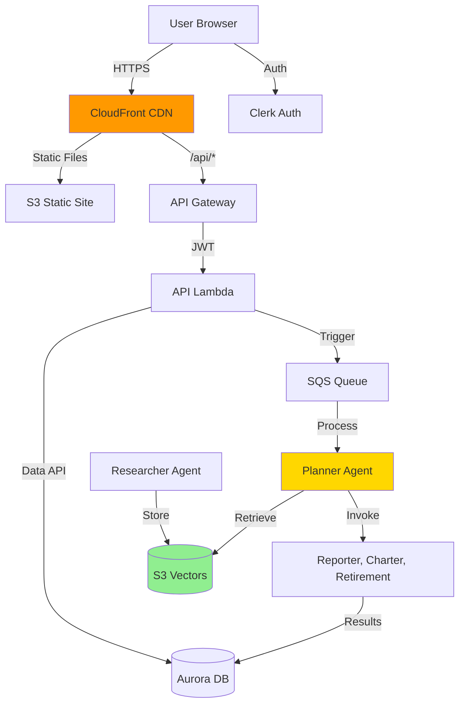

# Alex - AI Financial Advisor Platform

<div align="center">
  
  
  **Agentic Learning Equities eXplainer**
  
  A production-grade multi-agent AI system for personalized financial planning and portfolio analysis.
  
  [](https://aws.amazon.com/)
  [](https://www.python.org/)
  [](https://www.typescriptlang.org/)
  [](https://www.terraform.io/)
  [](LICENSE)
</div>

---

## 📋 Table of Contents

- [Overview](#overview)
- [Features](#features)
- [Architecture](#architecture)
- [Tech Stack](#tech-stack)
- [Prerequisites](#prerequisites)
- [Getting Started](#getting-started)
- [Deployment Guide](#deployment-guide)
- [Project Structure](#project-structure)
- [Cost Analysis](#cost-analysis)
- [Security](#security)
- [Monitoring & Observability](#monitoring--observability)
- [Contributing](#contributing)
- [License](#license)
- [Acknowledgments](#acknowledgments)

---

## 🎯 Overview

**Alex** is an enterprise-grade SaaS financial planning platform that leverages multiple specialized AI agents to provide comprehensive portfolio analysis, retirement projections, and personalized financial advice. Built entirely on AWS serverless architecture, it demonstrates production-ready AI system deployment with emphasis on cost optimization, security, and scalability.

### Key Highlights

- 🤖 **5 Specialized AI Agents** working in orchestration
- 💰 **90% Cost Reduction** using S3 Vectors vs traditional vector databases
- 🚀 **Serverless Architecture** for automatic scaling and cost efficiency
- 🔒 **Enterprise Security** with multi-layer authentication and guardrails
- 📊 **Real-time Analysis** with parallel agent processing
- 🌐 **Production-Ready** with monitoring, observability, and error handling

---

## ✨ Features

### Portfolio Management
- ✅ Multiple investment account support (401k, IRA, Taxable, etc.)
- ✅ Position tracking with real-time market data
- ✅ Cash balance management
- ✅ Portfolio diversification analysis

### AI-Powered Analysis
- 🎯 **Multi-Agent Orchestra** - 5 specialized agents collaborate to provide comprehensive analysis
- 📝 **Detailed Reports** - Executive summaries, risk assessments, and recommendations in markdown
- 📊 **Interactive Charts** - Dynamic visualizations for asset allocation, sectors, and geography
- 🎯 **Retirement Projections** - Monte Carlo simulations with success probabilities
- 🔍 **Market Research** - Autonomous agent continuously gathers financial insights

### User Experience
- 🔐 Secure authentication via Clerk
- 🎨 Modern, responsive UI with NextJS and Tailwind CSS
- ⚡ Real-time progress tracking for AI analysis
- 📱 Mobile-friendly design
- 🌍 Global CDN delivery via CloudFront

---

## 🏗️ Architecture

### System Overview



### Multi-Agent Collaboration

The system uses **5 specialized AI agents** orchestrated by the Financial Planner:

1. **Financial Planner** (Orchestrator) - Coordinates the analysis workflow
2. **InstrumentTagger** - Classifies financial instruments and enriches data
3. **Report Writer** - Generates comprehensive portfolio analysis
4. **Chart Maker** - Creates data visualizations
5. **Retirement Specialist** - Projects retirement scenarios

Plus an autonomous **Researcher Agent** that runs independently every 2 hours to gather market intelligence.

---

## 🛠️ Tech Stack

### AI & Machine Learning
- **OpenAI Agents SDK** - Agent framework for orchestration and tracing
- **AWS Bedrock** - Nova Pro model for AI capabilities
- **LiteLLM** - Unified interface for multiple LLM providers
- **SageMaker Serverless** - HuggingFace embeddings (all-MiniLM-L6-v2)
- **S3 Vectors** - Cost-effective vector storage (90% cheaper than OpenSearch)

### Backend
- **FastAPI** - Modern Python web framework on Lambda
- **OpenAI Agents SDK** - Agent orchestration
- **Pydantic** - Data validation and schemas
- **Tenacity** - Retry logic with exponential backoff
- **Boto3** - AWS SDK for Python

### Frontend
- **Next.js** (Pages Router) - React framework with SSG
- **TypeScript** - Type-safe JavaScript
- **Tailwind CSS** - Utility-first CSS framework
- **Recharts** - Composable charting library
- **Clerk** - Authentication and user management

### Infrastructure
- **Terraform** - Infrastructure as Code
- **AWS Lambda** - Serverless compute (6 functions)
- **Aurora Serverless v2** - PostgreSQL with Data API
- **App Runner** - Container hosting for Researcher
- **API Gateway** - RESTful API management
- **SQS** - Message queue for orchestration
- **CloudFront** - Global CDN
- **CloudWatch** - Logging and monitoring
- **Secrets Manager** - Secure credential storage

### Observability
- **LangFuse** - Agent tracing and token tracking
- **CloudWatch Dashboards** - Custom metrics visualization
- **Structured Logging** - JSON logs for analysis

---

## 📋 Prerequisites

Before deploying Alex, ensure you have:

### Required Tools
- **AWS Account** with IAM user and CLI configured
- **AWS CLI** v2.x or later
- **Terraform** v1.5 or later
- **Docker Desktop** (running)
- **Python** 3.12+ with `uv` package manager
- **Node.js** 20+ and npm
- **Git**

### Required AWS Services Access
- SageMaker
- Bedrock (Nova Pro model in us-west-2)
- Lambda
- Aurora Serverless v2
- S3 and S3 Vectors
- API Gateway
- CloudFront
- App Runner
- SQS
- EventBridge
- Secrets Manager

### External Services
- **Clerk Account** (free tier) for authentication
- **Polygon.io API Key** (free tier) for market data
- **OpenAI API Key** (for LangFuse tracing)
- **LangFuse Account** (free tier, optional but recommended)

---

## 🚀 Getting Started

### Quick Start Guide

The complete deployment is organized into **8 progressive guides** in the `/guides` directory. Follow them in order:

1. **[Guide 1: AWS Permissions](guides/1_permissions.md)** - Set up IAM permissions
2. **[Guide 2: SageMaker](guides/2_sagemaker.md)** - Deploy embedding endpoint
3. **[Guide 3: Ingestion](guides/3_ingest.md)** - Set up S3 Vectors and Lambda
4. **[Guide 4: Researcher](guides/4_researcher.md)** - Deploy autonomous research agent
5. **[Guide 5: Database](guides/5_database.md)** - Deploy Aurora Serverless v2
6. **[Guide 6: Agents](guides/6_agents.md)** - Deploy the 5-agent orchestra
7. **[Guide 7: Frontend](guides/7_frontend.md)** - Deploy NextJS application
8. **[Guide 8: Enterprise](guides/8_enterprise.md)** - Add monitoring and observability

### Environment Setup

1. **Clone the repository:**
   ```bash
   git clone https://github.com/yourusername/alex.git
   cd alex
   ```

2. **Configure AWS CLI:**
   ```bash
   aws configure
   # Enter your AWS Access Key ID, Secret Key, and default region
   ```

3. **Create environment file:**
   ```bash
   cp .env.example .env
   # Edit .env with your AWS account ID and region
   ```

4. **Install Python dependencies:**
   ```bash
   # uv is used for all Python package management
   pip install uv
   ```

5. **Install frontend dependencies:**
   ```bash
   cd frontend
   npm install
   ```

---

## 📦 Deployment Guide

### Infrastructure Deployment

Each component has its own Terraform directory with independent state:

```bash
# Navigate to each terraform directory and deploy in order
cd terraform/2_sagemaker
cp terraform.tfvars.example terraform.tfvars
# Edit terraform.tfvars with your values
terraform init
terraform apply
```

Repeat for directories 3-8 in sequence.

### Lambda Functions Packaging

```bash
# Package all Lambda functions using Docker
cd backend
uv run package_docker.py

# Deploy packaged functions
uv run deploy_all_lambdas.py
```

### Frontend Deployment

```bash
# Build frontend
cd frontend
npm run build

# Deploy to S3 and invalidate CloudFront
cd ../scripts
uv run deploy.py
```

### Local Development

Test locally before deploying:

```bash
# Start both backend and frontend
cd scripts
uv run run_local.py

# Frontend: http://localhost:3000
# Backend API: http://localhost:8000
# API Docs: http://localhost:8000/docs
```

---

## 📁 Project Structure

```
alex/
├── backend/                 # Agent code and Lambda functions
│   ├── api/                # FastAPI backend Lambda
│   ├── planner/            # Orchestrator agent
│   ├── tagger/             # Classification agent
│   ├── reporter/           # Analysis agent
│   ├── charter/            # Visualization agent
│   ├── retirement/         # Projection agent
│   ├── researcher/         # Autonomous research agent (App Runner)
│   ├── ingest/             # Document ingestion Lambda
│   └── database/           # Shared database library
│
├── frontend/               # NextJS React application
│   ├── pages/             # Next.js pages
│   ├── components/        # React components
│   ├── lib/               # Utilities and API client
│   └── styles/            # Tailwind CSS
│
├── terraform/              # Infrastructure as Code
│   ├── 2_sagemaker/       # SageMaker endpoint
│   ├── 3_ingestion/       # S3 Vectors and ingest Lambda
│   ├── 4_researcher/      # App Runner service
│   ├── 5_database/        # Aurora Serverless v2
│   ├── 6_agents/          # Multi-agent Lambda functions
│   ├── 7_frontend/        # CloudFront, S3, API Gateway
│   └── 8_enterprise/      # Monitoring and dashboards
│
├── scripts/                # Deployment scripts
│   ├── deploy.py          # Frontend deployment
│   ├── run_local.py       # Local development
│   └── destroy.py         # Cleanup script
│
└── guides/                 # Step-by-step deployment guides
    ├── 1_permissions.md
    ├── 2_sagemaker.md
    ├── 3_ingest.md
    ├── 4_researcher.md
    ├── 5_database.md
    ├── 6_agents.md
    ├── 7_frontend.md
    └── 8_enterprise.md
```

---

## 💰 Cost Analysis

### Monthly Operational Costs

| Service | Monthly Cost | Notes |
|---------|--------------|-------|
| **S3 Vectors** | ~$30 | 90% cheaper than OpenSearch! |
| **Aurora Serverless v2** | ~$43-60 | Biggest cost (0.5-1 ACU) |
| **Lambda Functions** | ~$1-5 | Pay per invocation |
| **SageMaker Serverless** | ~$5-10 | Pay per request |
| **App Runner** | ~$5 | 1 vCPU, 2GB RAM |
| **API Gateway** | ~$1-4 | 1M requests free tier |
| **CloudFront** | ~$1 | CDN delivery |
| **SQS** | <$1 | Message queue |
| **CloudWatch** | ~$5 | Logs and metrics |
| **Bedrock (Nova Pro)** | Variable | ~$0.01-0.10 per analysis |
| **Total** | **~$50-70** | For development/testing |

### Cost Optimization Tips

- **Destroy Aurora** when not actively developing (saves ~$43/month)
- **Use serverless endpoints** - scales to zero when not in use
- **Monitor costs** with AWS Cost Explorer
- **Set billing alarms** to avoid surprises
- **S3 Vectors vs OpenSearch** = **90% savings** 🎉

---

## 🔒 Security

### Multi-Layer Security Implementation

#### Authentication & Authorization
- ✅ **Clerk Authentication** - Enterprise SSO with JWT tokens
- ✅ **API Gateway** - Request throttling and API key validation
- ✅ **IAM Least Privilege** - Minimal permissions for each service

#### Data Protection
- ✅ **Secrets Manager** - Encrypted credential storage
- ✅ **Data API** - No VPC needed, simplified security
- ✅ **HTTPS Everywhere** - TLS for all communications
- ✅ **CORS Protection** - Origin validation

#### Application Security
- ✅ **Input Validation** - Pydantic schemas prevent injection
- ✅ **XSS Protection** - Content Security Policy headers
- ✅ **Output Sanitization** - Prevent malicious content
- ✅ **Rate Limiting** - DDoS protection

#### AI-Specific Security
- ✅ **Guardrails** - Validate agent outputs
- ✅ **Prompt Injection Prevention** - Input sanitization
- ✅ **Response Size Limits** - Prevent runaway token usage
- ✅ **Audit Trails** - Complete logging of AI decisions

---

## 📊 Monitoring & Observability

### CloudWatch Integration
- **Custom Dashboards** - Bedrock, SageMaker, and agent metrics
- **CloudWatch Alarms** - Automated alerting for errors and performance
- **Structured Logging** - JSON logs for easy parsing
- **Log Aggregation** - Centralized logging across all services

### LangFuse Observability
- **Agent Traces** - Complete visibility into agent interactions
- **Token Tracking** - Monitor usage and costs
- **Performance Metrics** - Response times and success rates
- **Debug Information** - Prompts, responses, and tool calls

### Key Metrics Tracked
- Lambda invocations and duration
- Agent success/failure rates
- Database query performance
- API response times
- Token usage and costs
- SQS queue depth
- Error rates by service

---

## 🧪 Testing

### Local Testing

Each agent has test files for local and AWS testing:

```bash
# Test locally with mocks
cd backend/planner
uv run test_simple.py

# Test deployed Lambda
uv run test_full.py

# Test all agents
cd backend
uv run test_simple.py  # Local
uv run test_full.py    # AWS
```

### Integration Testing

```bash
# Test multi-user scenarios
cd backend
uv run test_multiple_accounts.py

# Test system scale
uv run test_scale.py
```

---

## 📚 Documentation

- **Deployment Guides** - Complete step-by-step in `/guides`
- **Architecture Overview** - `guides/architecture.md`
- **Agent Architecture** - `guides/agent_architecture.md`
- **API Documentation** - FastAPI auto-generated at `/docs`
- **Code Comments** - Inline documentation throughout

---

## 🤝 Contributing

This project was created as a capstone for educational purposes. While it's not actively seeking contributions, feel free to:

1. **Fork the repository**
2. **Create feature branches**
3. **Submit pull requests** with improvements
4. **Report issues** you encounter
5. **Share your learnings**

### Development Guidelines

- Follow existing code structure and patterns
- Use `uv` for Python package management
- Write tests for new features
- Update documentation for changes
- Follow PEP 8 for Python code
- Use TypeScript for frontend code

---

## 📄 License

This project is licensed under the MIT License - see the [LICENSE](LICENSE) file for details.

---

## 🙏 Acknowledgments

### Course & Instructor
- **Ed Donner** - Instructor for "AI in Production" course on Udemy
- Course provided comprehensive guides and hands-on learning

### Technologies & Services
- **AWS** - Cloud infrastructure
- **OpenAI** - Agents SDK framework
- **Clerk** - Authentication platform
- **LangFuse** - Observability platform
- **Terraform** - Infrastructure as Code
- **Vercel** - Next.js framework

### Open Source Projects
- All the amazing open-source libraries used in this project

---

## 📧 Contact & Support

**Questions or Issues?**
- Open an issue in this repository
- Review the comprehensive guides in `/guides`
- Check the troubleshooting sections in each guide

**Want to learn more about this project?**
- Review the architecture diagrams
- Explore the code structure
- Follow the deployment guides

---

## 🌟 Star History

If you find this project helpful, consider giving it a ⭐!

---

<div align="center">
  
  **Built with 🚀 by [Your Name]**
  
  Demonstrating production AI deployment with AWS serverless architecture
  
  [⬆ Back to Top](#alex---ai-financial-advisor-platform)
  
</div>
